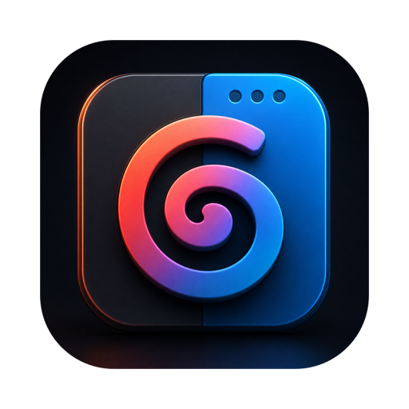
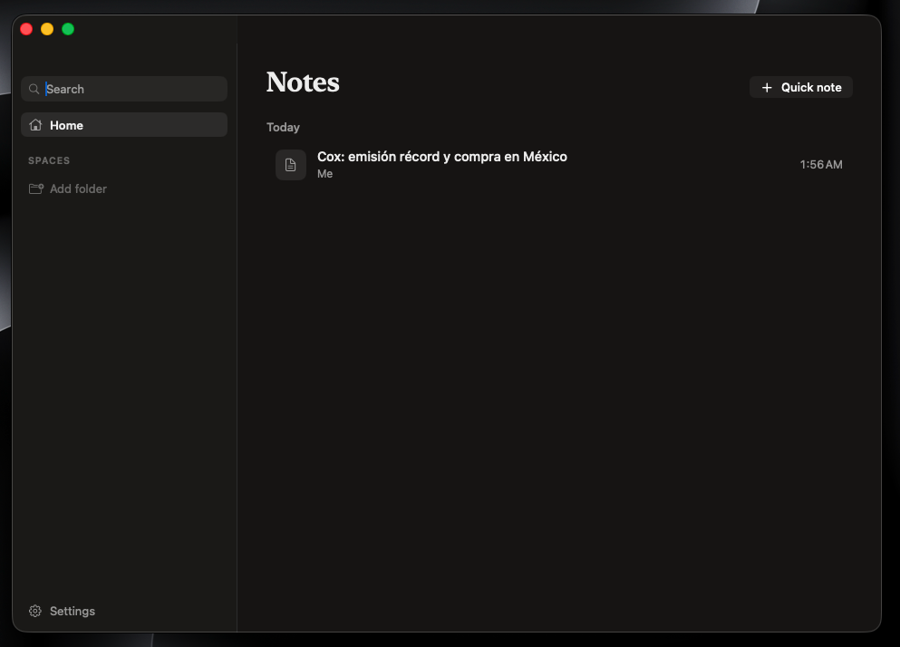

<div align="center">
  

  # Grañipa

  **The fully local, open-source meeting notes app for macOS — plus the productivity tools you keep paying subscriptions for.**

  
  
  
  

  **English** | [简体中文](README.zh-CN.md)
</div>

---

Grañipa records your meetings (no bot joins the call), transcribes them live on-device, figures out who said what, turns your rough notes into polished ones with AI, and pushes everything to your own services — while also replacing your clipboard manager, OCR tool, and window manager.

**No accounts. No cloud. No subscriptions.** Your data never leaves your Mac unless *you* send it somewhere.

> Built as a personal replacement for Granola ($14/month), Raycast clipboard history, TextSniper, and Rectangle — in one native app.

> 🚧 **Beta** — currently in internal testing. The v1.0 public release (with a notarized download, demo video and screenshots) is around the corner. Found a bug? [Open an issue](../../issues).

<p align="center">
  
</p>

## Features

### 🎙 Meetings

- **Bot-free recording** — captures your mic and the system audio (other participants) as two clean channels via a Core Audio process tap. Works with Zoom, Meet, Teams, Webex, anything that plays audio.
- **Live on-device transcription** — Apple SpeechAnalyzer (macOS 26), streaming word-by-word. Free and offline.
- **Automatic language detection** — pick up to 3 languages (15+ supported by Apple's engine); each recording probes them in parallel for the first seconds and keeps the winner.
- **Speaker diarization** — splits remote participants into Speaker 1/2/3 locally (CoreML), then infers their real names from conversation context.
- **AI-enhanced notes** — your rough notes + the transcript become structured notes, a summary, action items, and a ready-to-send follow-up email. Auto-titles the meeting.
- **Bring your own AI subscription** — shells out to the `claude`, `codex`, `gemini`, or `grok` CLI you already pay for. **No API keys, no per-token billing.**
- **Templates** — per-meeting-type prompts (1:1, standup, sales call…), fully editable.
- **Folders & teams** — organize meetings Granola-style; structure is exposed through the API.
- **Calendar integration** — upcoming meetings in the app, one-click record, auto-titling from the event.
- **Auto-detection** — notices when a meeting app starts using the mic and offers to record; can auto-stop when the call ends.
- **Search** — full-text across titles, notes, and transcripts.

### 🧰 Productivity

- **Clipboard history** (`⌥⇧V`) — Raycast-style floating panel: search, type filters, image previews, source app, auto-paste into the active app. Respects password-manager confidentiality markers. 100% local.
- **Screen text capture / OCR** (`⌥⇧T`) — select any screen region, the text lands in your clipboard (Vision framework, follows your selected languages).
- **Window management** (`⌃⌥` + arrows/letters) — Rectangle-compatible shortcuts: halves, quarters, thirds, maximize, center, restore.

### 🔌 Integrations

- **Local REST API** — `127.0.0.1:7799`, bearer-token auth: meetings, transcripts, notes, folders, trigger enhancement.
- **Webhooks** — HMAC-SHA256-signed POSTs on `meeting.started`, `meeting.completed` (full transcript included), `notes.enhanced`, with retry + backoff.

## Shortcuts

| Shortcut | Action |
|---|---|
| `⌥⇧V` | Clipboard history panel |
| `⌥⇧T` | Capture screen text (OCR) |
| `⌃⌥ ←` `→` `↑` `↓` | Snap window to half |
| `⌃⌥ ⏎` / `⌃⌥ C` | Maximize / center window |
| `⌃⌥ U` `I` `J` `K` | Window quarters |
| `⌃⌥ D` `F` `G` | Window thirds |
| `⌃⌥ ⌫` | Restore previous window size |

## Requirements

- **macOS 26+** on Apple Silicon.
- Xcode 26 toolchain (to build from source).
- At least one AI CLI installed and logged in: [Claude Code](https://docs.anthropic.com/claude-code), OpenAI Codex, Gemini CLI, or Grok — only needed for note enhancement; recording and transcription work without any.

## Install

### Download (recommended)

Grab the latest notarized build from [Releases](../../releases), unzip, and drag **Grañipa.app** to `/Applications`. Signed and notarized — no Gatekeeper warnings.

### Build from source

```sh
git clone https://github.com/Zertyn-Enterprises/granipa.git
cd granipa
./Scripts/bundle.sh release
open "build/Grañipa.app"
```

The bundle script signs with your first Apple Development certificate if you have one (set `CODESIGN_ID` to override), falling back to ad-hoc signing. A real certificate is strongly recommended — with ad-hoc signing, macOS forgets the app's permissions on every rebuild.

### First-run permissions

| Prompt | Why | When |
|---|---|---|
| Microphone | Your side of the conversation | First recording |
| System Audio Recording | The other participants | First recording |
| Calendars | Upcoming meetings in the sidebar | Launch |
| Notifications | "Meeting detected — record?" | Launch |
| Screen Recording | OCR capture (`⌥⇧T`) | First OCR |
| Accessibility | Auto-paste + window snapping | First use |

On the first recording per language, macOS downloads the speech model once. On the first multi-speaker meeting, the diarization models (~130 MB) download once from HuggingFace; everything runs offline afterwards.

## REST API

Settings → API holds the bearer token.

```sh
TOKEN=...
curl -H "Authorization: Bearer $TOKEN" http://127.0.0.1:7799/v1/meetings
curl -H "Authorization: Bearer $TOKEN" http://127.0.0.1:7799/v1/meetings/<id>/transcript
curl -H "Authorization: Bearer $TOKEN" "http://127.0.0.1:7799/v1/meetings?folder=<folderId>"
curl -H "Authorization: Bearer $TOKEN" http://127.0.0.1:7799/v1/folders
curl -X POST -H "Authorization: Bearer $TOKEN" http://127.0.0.1:7799/v1/meetings/<id>/enhance
```

Webhook payloads are signed; verify like GitHub webhooks:

```python
import hmac, hashlib
expected = "sha256=" + hmac.new(secret.encode(), body, hashlib.sha256).hexdigest()
valid = hmac.compare_digest(expected, request.headers["X-Granipa-Signature"])
```

## Privacy

- Audio, transcripts, notes, and clipboard history live in `~/Library/Application Support/Granipa/` (SQLite + files). Delete the folder, everything is gone.
- The **only** data that leaves your Mac: transcripts sent to the AI CLI *you* configured when enhancement runs, and webhook payloads to URLs *you* added.
- No telemetry, no analytics, no accounts, no auto-updates.

## Development

```sh
swift build        # compile
swift test         # 64 tests: storage, API, webhooks, language detection, window math…
./Scripts/bundle.sh  # debug .app bundle
```

Architecture notes for contributors (and AI agents) live in [CLAUDE.md](CLAUDE.md). PRs welcome — see [CONTRIBUTING.md](CONTRIBUTING.md).

## Roadmap

- **Ask your notes** — chat with one meeting or your whole archive, answered by your local AI CLI.
- **Auto-updates** (Sparkle) for the notarized binary.
- **⌥Space command palette** — meetings, clipboard, snippets and actions in one launcher.
- Configurable shortcuts · light mode · audio language ID for any-language detection.

## FAQ

**The transcript stays empty, or only my voice is transcribed.**
Grant *System Audio Recording* (System Settings → Privacy & Security → Screen & System Audio Recording), then stop and start a **new** recording. If you granted it long ago and it silently stopped working (e.g. after switching from ad-hoc to certificate signing), reset it: `tccutil reset AudioCapture com.zertyn.granipa` and record again. System audio only flows while the meeting app is actually playing sound. If you build from source with ad-hoc signing, macOS forgets permissions on every rebuild — use a real certificate.

**"Enhancement failed" after a meeting.**
The selected AI CLI isn't installed or isn't logged in. Run it once in a terminal (e.g. `claude`) and complete its login, then check Settings → AI shows it as detected.

**How do I connect my Claude / ChatGPT / Gemini / Grok account? Do I need an API key?**
No API keys, ever. Grañipa drives each provider's official CLI, which authenticates with the subscription you already pay for: install it (e.g. `npm install -g @anthropic-ai/claude-code`), run it once in Terminal, and a browser window opens to sign in. After that one-time login everything is automatic — credentials are stored by the CLI itself and Grañipa never sees them. Settings → AI shows install commands and a **Test** button per provider.

**The window-snapping or clipboard shortcuts don't work.**
Another app owns those hotkeys — quit Rectangle (same ⌃⌥ scheme) or check Raycast's custom hotkeys, then relaunch Grañipa. Auto-paste and window snapping also need the Accessibility permission.

**Where is my data? How do I delete it?**
Everything lives in `~/Library/Application Support/Granipa/`. Delete that folder and it is all gone.

## Acknowledgments

- [GRDB.swift](https://github.com/groue/GRDB.swift) (MIT) — storage.
- [FluidAudio](https://github.com/FluidInference/FluidAudio) (Apache-2.0) — speaker diarization. Its CoreML models are derived from [pyannote](https://github.com/pyannote/pyannote-audio) and licensed CC-BY-4.0.
- [AudioCap](https://github.com/insidegui/AudioCap) and Apple's Core Audio taps sample — reference for system-audio capture.
- [Granola](https://granola.ai), [Raycast](https://raycast.com), and [Rectangle](https://rectangleapp.com) — the inspiration. Go pay them if you want a polished, supported product; build this if you want it local and yours.

Granola, Raycast, Rectangle, TextSniper and all other product names mentioned are trademarks of their respective owners. Grañipa is an independent project, not affiliated with or endorsed by any of them.

## License

[MIT](LICENSE)
